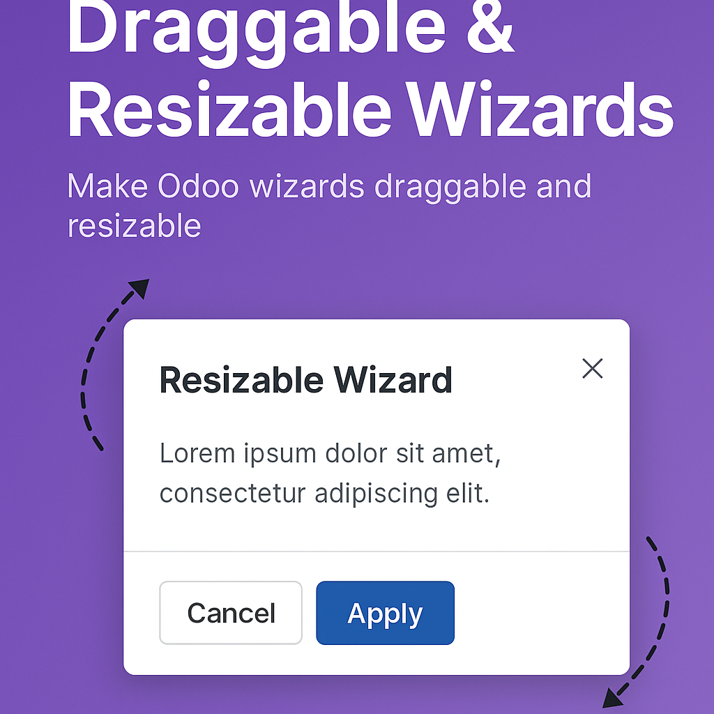
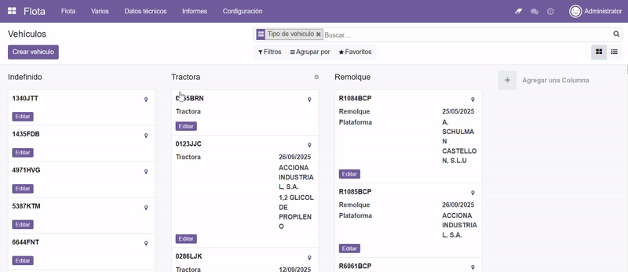

# Draggable and Resizable Wizard (Odoo)



Make every wizard dialog in the Odoo backend **draggable** and **resizable**, so users can move and adjust modal windows to fit their workflow and screen space.



## Features

- **Draggable wizards** — move any Odoo dialog anywhere within the browser window (drag by the modal header).
- **Resizable wizards** — adjust the width and height of dialogs using the native resize handle in the bottom-right corner.
- **Maximize / restore** — double-click the dialog header to maximize it (90% of the viewport) and double-click again to restore.
- **Seamless integration** — no configuration required; works out of the box for all wizards.
- **Smart bounds** — dialogs stay within the viewport (max 96vw/96vh, min 400×200px, scaled down on narrow screens) and are clamped to the viewport edges when dragged or resized.
- **Clean lifecycle** — all event listeners and jQuery UI state are removed when a dialog closes (no memory leaks).

## Compatibility

- Odoo **15.0** (Community / Enterprise)
- License: **LGPL-3**

## Installation

1. Copy the `draggable_and_resizable_wizard` folder into your Odoo custom addons directory (or clone this repo there).
2. Update the app list in Odoo (*Settings → Apps → Update Apps List*).
3. Install the **Draggable-Resizable Wizard** module.

## Usage

Once installed, simply open any wizard in the Odoo backend:

- **Drag** the dialog by its header to reposition it.
- **Resize** it using the resize handle at the bottom-right corner of the dialog content.
- **Double-click** the header to maximize/restore the dialog.

## How It Works

The module patches the OWL `Dialog` component from `@web/core/dialog/dialog` (and also handles legacy Bootstrap modals via `shown.bs.modal` / `hidden.bs.modal`):

- `static/src/js/draggable_wiz.js` — on mount, each modal is made `position: fixed`, centered, and given jQuery UI `draggable()` behavior (modal header as the drag handle). Positions are clamped to the viewport after dragging, a debounced window-resize handler re-clamps the dialog, and a cleanup routine (run on `onWillDestroy` / `hidden.bs.modal`) removes all listeners and destroys the jQuery UI state. Double-clicking the header maximizes/restores the dialog.
- `static/src/css/draggable.css` — enables the native `resize: both` grip on `.modal-content`, sets min/max size constraints (responsive via `min()`), rounded corners, and grab/grabbing cursors on the header.

Both assets are loaded into `web.assets_backend`.

## Repository Structure

```
odoo_draggable_resizable_wizard/
└── draggable_and_resizable_wizard/
    ├── __manifest__.py          # Module manifest (Odoo 15.0, v1.0.0)
    ├── __init__.py
    ├── LICENSE                  # LGPL-3
    ├── README.rst
    └── static/
        ├── description/         # App store banner, icon, demo gif
        └── src/
            ├── css/draggable.css
            └── js/draggable_wiz.js
```

## Credits

- **Developer / Maintainer:** Tomás Raigal

## License

This module is released under the terms of the **GNU LGPL v3.0**.
